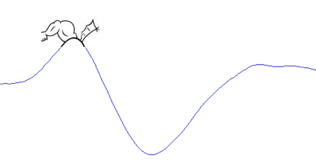

.. burstiDAtor documentation master file, created by
   sphinx-quickstart on Sat Jul 19 14:34:56 2014.
   You can adapt this file completely to your liking, but it should at least
   contain the root `toctree` directive.

burstiDAtor
===========

BurstiDAtor is lightweight discharge analysis program for neural extracellular single unit recordings, implementing :ref:`burst detection <burst_detection>` as proposed by [GB84]_ and [HAJ07_].

Burstidator is implemented in the Java and Matlab/Octave languages. 

Releases (including runnable java archive ``.jar`` files and documentation) are available from https://github.com/nno/burstiDAtor/releases.

Source code is available from https://github.com/nno/burstiDAtor.

.. toctree::
    :maxdepth: 2
   
    readme
    get_started 
    manual
    faq
    about
    license

.. Indices and tables
   ==================
   * :ref:`genindex`
   * :ref:`modindex`
   * :ref:`search`

.. [GB84] Grace, A. A., & Bunney, B. S. (1984). The control of firing pattern in nigral dopamine neurons: burst firing. The Journal of Neuroscience: The Official Journal of the Society for Neuroscience, 4(11), 2877–90.

.. [HAJ07] Hajos M, Allers KA, Jennings K, Sharp T, Charette G, Sík A, and Kocsis B (2007) Neurochemical identification of stereotypic burst-firing neurons in the rat dorsal raphe nucleus using juxtacellular labelling methods. Eur J Neurosci 25:119–26.

