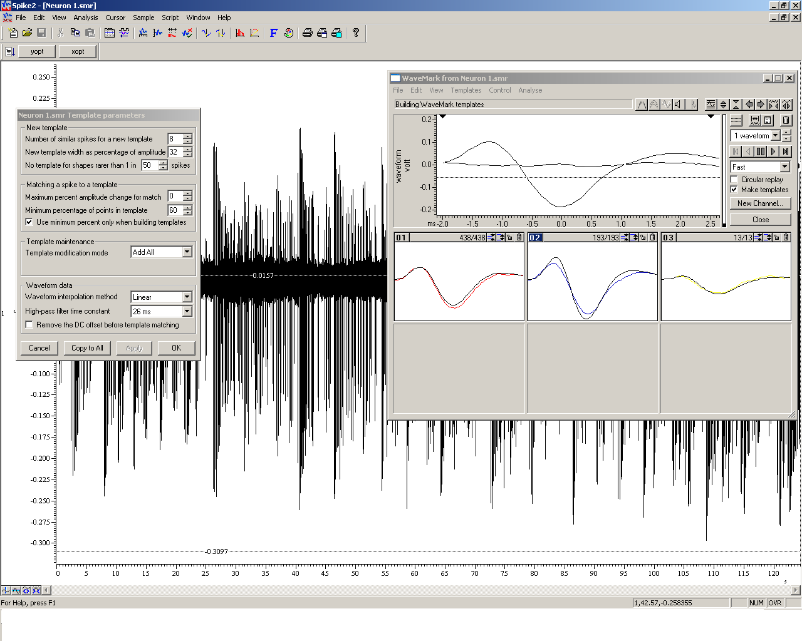
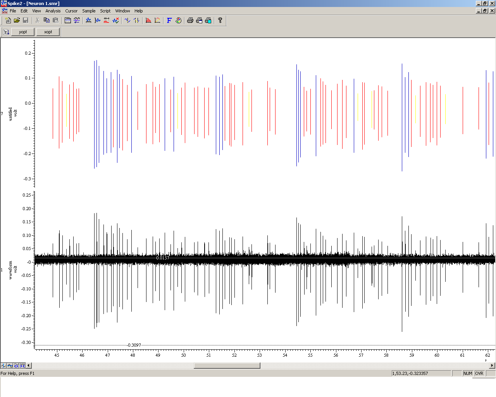
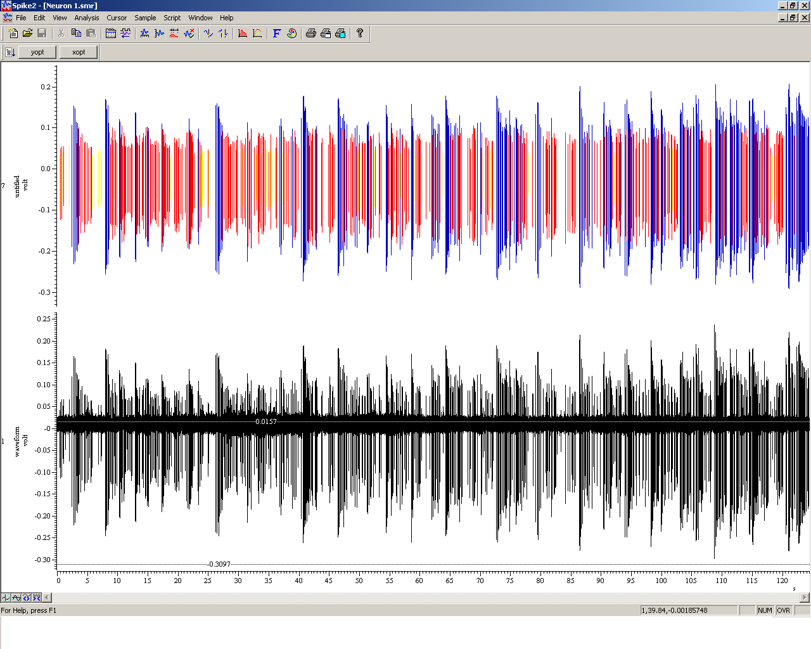
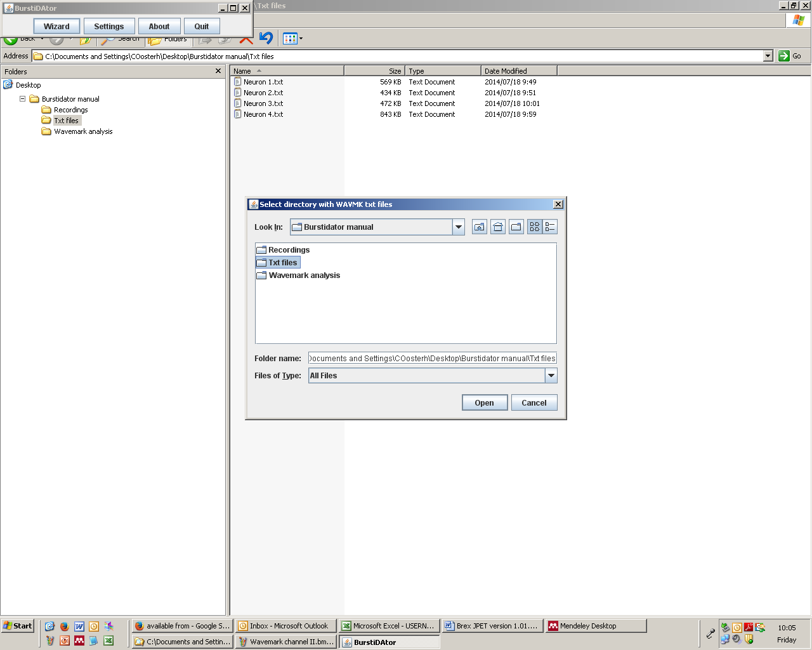
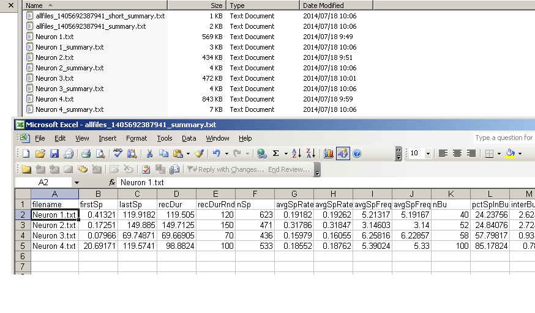

User manual
***********
This manual describes how to use burstiDAtor to detect bursts in neural spike data, using the criteria of [GB84]_. Using wavemark analysis in Spike2 and burstiDAtor, most relevant discharge characteristics (such as firing rate, burst frequency, spikes per burst, interspike interval, etc) of these can be obtained using the following steps.

Software requirements
---------------------
Required software to run the steps described in this manual:

- Java virtual machine (to run burstiDAtor). In most cases this is already installed on your system if you use a Microsoft Windows, Apple OS X, or Linux operating system.
- burstiDAtor java archive file ``burstiDAtor.jar``. It can be downloaded from  https://github.com/nno/burstiDAtor/releases.
- Spike2 (for spike detection).
- A spreadsheet program that can import comma separated  (``.csv``) files, such as Microsoft Excel or LibreOffice.

Spike analysis in Spike2
------------------------

* Analyze all neurons in the folder ``recordings`` [TODO] using the wavemark analysis tool:

    + file; analysis; new wavemark...
    + adjust horizontal & vertical triggers
    + check the box *make template*
    + click the *play* button
    + new channel

.. _fig_building_wavemarks:

   Building wavemarks in Spike2

* After verifying that the wavemark channel reflects the firing activity of the neurons in the recording channel, select the wavemark channel (double-click on it, or select *view* ;  *show/hide channel*). See :ref:`fig_building_wavemarks`.

    + In the folder ``wavemark_analysis``, example wavemark channels are provided for each recordings. [TODO]

* Select *file*;  *export as*.
* Enter a name, and in the *save as type* drop down box, select *text file*; *ok*.
* Enter the interval of which analysis is desired and click ok.

  + See the folder ``wavemark_output`` for the example wavemark channels exported as ``*.txt`` files. [TODO]. As an example, see :ref:`fig_wavemark_channel` and `fig_wavemark_channel_detail`.

.. _fig_wavemark_channel:

   Visualization of a wavemark channel in Spike2. For noise filtering purposes, wavemark 0 has been removed from the wavemark channel.

.. _fig_wavemark_channel_detail:

   An zoomed-in visualization of a wavemark channel in Spike2. For noise filtering purposes, wavemark 0 has been removed from the wavemark channel.

Most work is done now. To let burstiDAtor do its magic, we only need to tell it where the text files are located that we want to analyze.

Burstidator analysis
--------------------
* Start burstiDAtor

  + usually this involves double-clicking the ``burstiDAtor.jar`` file.

* Optionally: to switch between burst detection for DA (dopamine), 5HT (serotonin), RTN (reticular thalamic nucleus) or GLU (glutamate) neuron burst detection, click ``type: DA`` / ``type: 5HT`` / ``type: RTN`` / ``type: GLU``.
* Click *Wizard*.
* Browse to the folder containing the ``*.txt`` output files from Spike2 (see above).
* Click *open*. BurstiDAtor will display the number of ``*.txt`` files in that folder.

  + it ignores any files ending with ``_summary.txt``, because the output from burstiDAtor is written to files with such names (see below).
  + it proposes to write its output in that same folder; click yes (see :ref:`fig_burstiDAtor_select_directory`).

.. _fig_burstiDAtor_select_directory:

   Select directory with wavemark .txt in burstiDAtor.

* Analysis is performed almost instantly (unless you are analyzing thousands of recordings, in which case it may take a bit longer), and we're done!

For each text file, burstidDAtor has now generated a ``*_summary.txt`` file that contains detailed information regarding the discharge actitivity of each individual neuron. Most importantly however, it has summarized the average discharge activity for each neuron in a ``*_summary.txt`` file and the more convenient ``*_short_summary.txt`` (simply select this file and drag it into Excel to see the contents; see :ref:`fig_output_in_excel`).

.. _fig_output_in_excel:

   Output of burstiDAtor shown in MS Excel.

Summary file format
-------------------
The summary file provides the following information:

======================= =======================================================
label                   meaning
======================= =======================================================
firstSp	                First spike
lastSp                  Last spike
recDur                  Recording duration (first to last spike)
recDurRndUp             Recordign duration, rounded up (to 10 seconds)
nSp                     Total number of spikes
avgSpRate               Average spikes (seconds per spike)
avgSpRateRndUp          Average spikes (seconds per spike), rounded up
avgSpFreq               Average spike frequency (spikes per second)
avgSpFreqRndUp          Average spike frequency (spikes per second), rounded up
nBu                     Total number of bursts, set to 0 if no bursts
nBuOrNada               Total number of bursts, set to empty if no bursts
pctSpInBu               Percent of spikes in burst
interBuIvl              Inter-burst interval
firstToLastBuCentered   First to last burst centered
CycleBu	                Burst cycle (time/bursts)
avgBuFreq               Average burst frequency (bursts/s)
avgBuFreqRndUp          Average burst frequency (bursts/s), rounded up
avgBuFreq60             Average burst frequency (bursts/minute)
avgBuFreq60RndUp        Average burst frequency (bursts/minute), rounded up
mu_nSp                  Average number of spikes/burst
md_nSp                  Median number of spikes/burst
std_nSp                 Standard deviation spikes/burst
mu_BuDur                Average burst duration
md_BuDur                Median burst duration
std_BuDur               Standard deviation burst duration
mu_SpFreq               Average firing frequency in bursts (Hz)
md_SpFreq               Median firing frequency in bursts (Hz)
std_SpFreq              Standard deviation firing frequency in bursts
mu_interSp              Mean inter-spike interval (ISI)
md_interSp              Median ISI
std_interSp             Standard deviation ISI
======================= =======================================================

